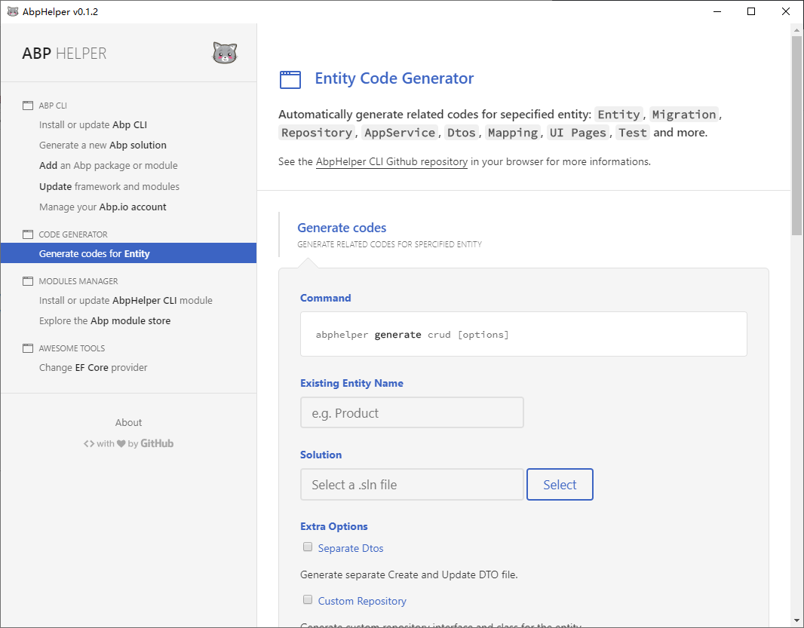
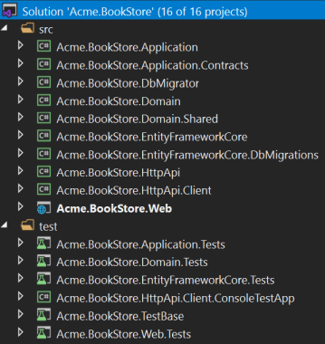

# 创建ABP项目

可以通过三种方式创建

1. 通过官方网站模板创建项目并下载到本地（就像SpringBoot），访问：<https://abp.io/get-started> 并点击 `DIRECT DOWNLOAD`，填入相关信息，保持 `Tiered` uncheck 的状态（勾上的话，会比不勾多创建两个项目，独立的IdentityServer和API.Hosted）
    - Tiered：将Identity、API、Web独立成微服务。（此时Identity默认是需要redis的，可以用docker在本地启动一个，默认端口）
    - Non-Tiered：整个项目为一个应用

2. 通过安装 ABP CLI，以命令行的方式创建项目。命令详细参数见：<https://docs.abp.io/en/abp/latest/CLI>

    ```shell
    dotnet tool install -g Volo.Abp.Cli

    abp new <solution-name> [options]
    ```

3. 利用GUI工具AbpHelper（个人倒觉得能做成VS Code插件好一些），能够创建新项目，添加新模块以及根据实体自动生成CRUD操作及界面，详情见：<https://github.com/EasyAbp/AbpHelper.GUI>

    

    之后，便可得到Solution的代码结构（DDD），下图为non-tiered的解决方案结构

    
