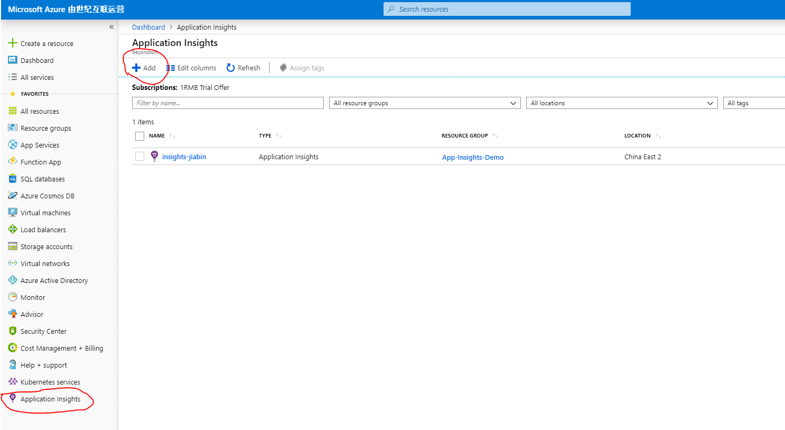
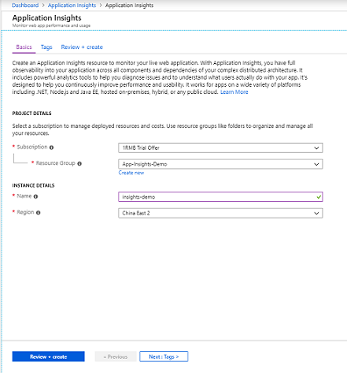
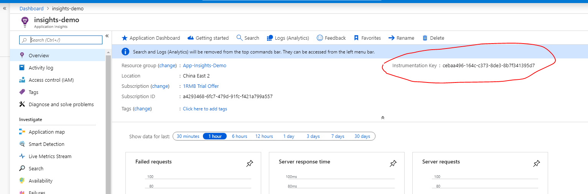

# Spring Boot & App Insights

> 参考文档：<https://docs.microsoft.com/en-us/azure/azure-monitor/app/java-get-started>

# 创建 Azure App Insights 资源

1. 浏览到位于 <https://portal.azure.cn/> 的 Azure（中国）门户，定位到 Application Insights，然后单击新建。

  

2. 在新建资源上，指定以下信息：
    - 选择订阅。
    - 选择资源组。
    - 输入资源名称。
    - 选择资源区域位置。

    

3. 资源创建后，导航到详情页面，可以查询到该 App Insights 的检测密钥。

  

# 将 Spring Boot 应用程序配置为使用 App Insights

1. 在项目的 POM.xml 文件中添加以下依赖项。

  ```xml
  <dependency>
      <groupId>com.microsoft.azure</groupId>
      <artifactId>applicationinsights-spring-boot-starter</artifactId>
      <version>1.2.0-BETA</version>
  </dependency>
  ```

2. 在项目的 application.properties 文件中添加以下属性（如果是yaml文件需要转换成层级结构）。

  > 此处为中国版的 Azure，与国际版的有所不同，需要设置专有的 endpoint，获取更多关于 [endpoint](https://docs.microsoft.com/bs-latn-ba/azure/azure-monitor/app/custom-endpoints?view=aspnetcore-3.0#regions-that-require-endpoint-modification) 的相关配置。有关其余更详细的配置信息，请查看 <https://github.com/Microsoft/ApplicationInsights-Java/blob/master/azure-application-insights-spring-boot-starter/README.md>

  ```properties
  # Specify the instrumentation key of your Application Insights resource.
  azure.application-insights.instrumentation-key=[your ikey from the resource]
  azure.application-insights.channel.in-process.endpoint-address=https://dc.applicationinsights.azure.cn/v2/track
  # Specify the name of your springboot application. This can be any logical name you would like to give to your app.
  spring.application.name=[your app name]
  ```

3. 在代码中引用 TelemetryClient 对象 **主动** 发送日志信息到 App Insights，以下为示例代码。

  ```java
  package com.example.demo;

  import com.microsoft.applicationinsights.TelemetryClient;
  import java.io.IOException;
  import org.springframework.beans.factory.annotation.Autowired;
  import org.springframework.web.bind.annotation.GetMapping;
  import org.springframework.web.bind.annotation.RequestMapping;
  import org.springframework.web.bind.annotation.RestController;
  import com.microsoft.applicationinsights.telemetry.Duration;

  @RestController
  @RequestMapping("/sample")
  public class TestController {

      @Autowired
      TelemetryClient telemetryClient;

      @GetMapping("/hello")
      public String hello() {

          //track a custom event
          telemetryClient.trackEvent("Sending a custom event...");

          //trace a custom trace
          telemetryClient.trackTrace("Sending a custom trace....");

          //track a custom metric
          telemetryClient.trackMetric("custom metric", 1.0);

          //track a custom dependency
          telemetryClient.trackDependency("SQL", "Insert", new Duration(0, 0, 1, 1, 1), true);

          return "hello";
      }
  }
  ```

# 将 Springboot 应用程序配置为向 Application Insights 自动发送 log4j 日志

> 如果日志系统采用的是 Logback，请参照另外的配置，<https://docs.microsoft.com/zh-cn/azure/azure-monitor/app/java-trace-logs>

1. 修改项目的 POM.xml 文件，添加/修改如下 dependency 节。

  ```xml
  <dependencies>
      <dependency>
          <groupId>org.springframework.boot</groupId>
          <artifactId>spring-boot-starter-web</artifactId>
          <exclusions>
              <exclusion>
                  <groupId>org.springframework.boot</groupId>
                  <artifactId>spring-boot-starter-logging</artifactId>
              </exclusion>
          </exclusions>
      </dependency>

      <dependency>
          <groupId>org.springframework.boot</groupId>
          <artifactId>spring-boot-starter-test</artifactId>
          <scope>test</scope>
      </dependency>

      <dependency>
          <groupId>org.springframework.boot</groupId>
          <artifactId>spring-boot-starter-log4j2</artifactId>
      </dependency>

      <dependency>
          <groupId>com.microsoft.azure</groupId>
          <artifactId>applicationinsights-spring-boot-starter</artifactId>
          <version>1.2.0-BETA</version>
      </dependency>

      <dependency>
          <groupId>com.microsoft.azure</groupId>
          <artifactId>applicationinsights-logging-log4j2</artifactId>
          <version>2.1.1</version>
      </dependency>
  </dependencies>
  ```

2. 修改 log4j2.xml 的配置，添加新的 Appender。注意给 Appender 添加日志的记录级别，筛选掉应用程序不必要的日志，这里设置为 `level="info"`。（这么做的原因是免费版的 Azure App Insights 记录日志的内存每天都有一定的限制，如果超出了限制，日志就进不到 App Insights 里了，而且程序也不会抛异常）

  ```xml {12,13,18}
  <?xml version="1.0" encoding="UTF-8" ?>
  <Configuration packages="com.microsoft.applicationinsights.log4j.v2">
    <Properties>
      <Property name="LOG_PATTERN">
        %d{yyyy-MM-dd HH:mm:ss.SSS} %5p ${hostName} --- [%15.15t] %-40.40c{1.} : %m%n%ex
      </Property>
    </Properties>
    <Appenders>
      <Console name="Console" target="SYSTEM_OUT">
        <PatternLayout pattern="%d{HH:mm:ss.SSS} [%t] %-5level %logger{36} - %msg%n"/>
      </Console>
      <ApplicationInsightsAppender name="aiAppender">
      </ApplicationInsightsAppender>
    </Appenders>
    <Loggers>
      <Root level="trace">
        <AppenderRef ref="Console" level="info" />
        <AppenderRef ref="aiAppender" level="info" />
      </Root>
    </Loggers>
  </Configuration>
  ```

  运行应用程序且等待一段时间后，在 Azure 的管理页面的 App Insights 资源就可以查看到对应log4j的日志信息。

  > *如果 java jdk 的版本过高，可能会遇到程序运行失败的情况（大概是因为 Java SE 9.0 中不再包含 Java EE 的指定包，参考 <https://blog.csdn.net/hadues/article/details/79188793>），此时需要在 POM.xml 中添加如下依赖项*

  ```xml
  <dependency>
      <groupId>javax.xml.bind</groupId>
      <artifactId>jaxb-api</artifactId>
      <version>2.2.8</version>
  </dependency>
  ```
