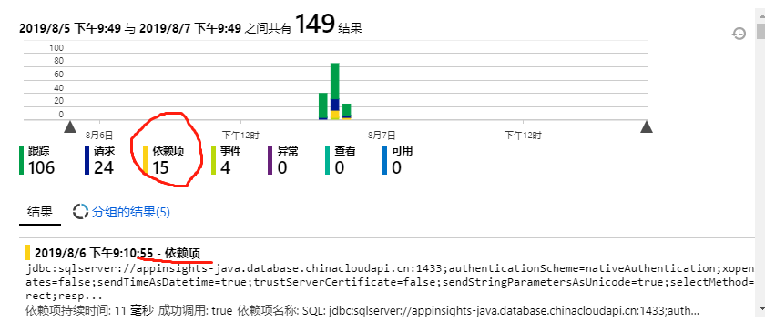

# App Insights（Java）外部依赖数据

> 如果还没有添加基础的依赖包，以及基本的 trace，request 的记录，请先阅读 [这篇文章](setup.md) 来搭建基础框架。  
> 参考文档：<https://docs.microsoft.com/en-us/azure/azure-monitor/app/java-agent>

# 创建数据库（MSSQL）并利用 Hibenate 来查询数据库

1. 这里采用了 Azure SQL Server（当然本地的数据库也是可以的），先设置防火墙规则，使本地 IP 可以访问到数据库。

2. 引入以下依赖包。注意这个包通过 IDE 工具无法 resolve，要到[这里](https://mvnrepository.com/artifact/com.microsoft.sqlserver/sqljdbc4/4.0)去下载 jar 文件并放到仓库的对应位置。

    ```xml
    <dependency>
        <groupId>com.microsoft.sqlserver</groupId>
        <artifactId>sqljdbc4</artifactId>
        <version>4.0</version>
    </dependency>
    ```

3. 添加数据库实体 `SignWorkDayEntity`、仓库对象 `WorkDayRepository`，并在控制器 `NoteController` 中引用并查询。

    ```java
    package com.example.demo.entities;

    import javax.persistence.*;
    import java.util.Date;

    @Entity
    @Table(name = "sign_workday")
    public class SignWorkDayEntity {
        @Id
        @GeneratedValue
        @Column(name = "ID")
        private Long id;

        @Column(name = "WORK_DATE")
        private Date workDate;

        @Column(name = "WORK_CODE")
        private String workCode;


        public Long getId() {
            return id;
        }

        public void setId(Long id) {
            this.id = id;
        }

        public Date getWorkDate() {
            return workDate;
        }

        public void setWorkDate(Date workDate) {
            this.workDate = workDate;
        }

        public String getWorkCode() {
            return workCode;
        }

        public void setWorkCode(String workCode) {
            this.workCode = workCode;
        }
    }
    ```

    ```java
    package com.example.demo.services;

    import com.example.demo.entities.SignWorkDayEntity;
    import org.springframework.data.jpa.repository.JpaRepository;
    import org.springframework.stereotype.Repository;

    @Repository
    public interface WorkDayRepository extends JpaRepository<SignWorkDayEntity, Long>{

    }
    ```

    ```java
    package com.example.demo.controller;

    import org.springframework.beans.factory.annotation.Autowired;
    import org.springframework.web.bind.annotation.RequestMapping;
    import org.springframework.web.bind.annotation.RestController;
    import org.springframework.web.bind.annotation.*;
    import java.util.List;

    import com.example.demo.services.WorkDayRepository;
    import com.example.demo.entities.SignWorkDayEntity;

    @RestController
    @RequestMapping("/api")
    public class NoteController {

        @Autowired
        WorkDayRepository workDayRepository;

        @GetMapping("/notes")
        public List<SignWorkDayEntity> getAllNotes() {
            return workDayRepository.findAll();
        }
    }
    ```

4. 在 property 文件中设置数据库连接信息

    ```properties
    spring.datasource.url=jdbc:sqlserver://appinsights-java.database.chinacloudapi.cn;databaseName=java
    spring.datasource.username=java-admin
    spring.datasource.password=xxx
    spring.datasource.driverClassName=com.microsoft.sqlserver.jdbc.SQLServerDriver
    spring.jpa.show-sql=true
    spring.jpa.properties.hibernate.dialect=org.hibernate.dialect.SQLServer2012Dialect
    spring.jpa.hibernate.ddl-auto = none
    ```

# 使用 applicationinsights-agent 来跟踪外部依赖项

1. 下载 applicationinsights-agent-2.4.0-BETA-SNAPSHOT.jar（可以参考[官方文档](https://docs.microsoft.com/en-us/azure/azure-monitor/app/java-agent)来下载）到程序根目录，添加如下的 AI-Agent.xml 配置文件（注意该配置文件要与 applicationinsights-agent-2.4.0-BETA-SNAPSHOT.jar 在同一目录，否则不起作用）

    ```xml
    <?xml version="1.0" encoding="utf-8"?>
    <ApplicationInsightsAgent>
        <Instrumentation debug="true">
            <BuiltIn enabled="true" />
        </Instrumentation>
        <AgentLogger></AgentLogger>
    </ApplicationInsightsAgent>
    ```

2. 通过以下命令启动 Java 程序（在 windows 系统下似乎启动不了，虽然已经安装了 Java 环境，不清楚为啥。。。我这里是用 docker 创建了一个容器来启动，记得 cd test）

    ```powershell
    docker run -i -t --rm -p 8080:8080 -v D:\repository\GitHub\appinsights-java\spring-boot\demo:/test openjdk:8-jdk-alpine

    java -javaagent:applicationinsights-agent-2.4.0-BETA-SNAPSHOT.jar -jar target/demo-0.0.1-SNAPSHOT.jar
    ```

3. 程序运行一段时间后，就会有 dependency 的数据出现在 App Insights 的 portal 里面了。

    
