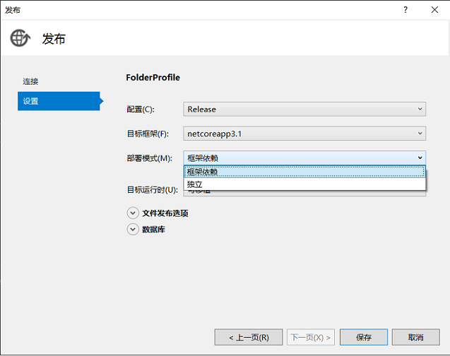
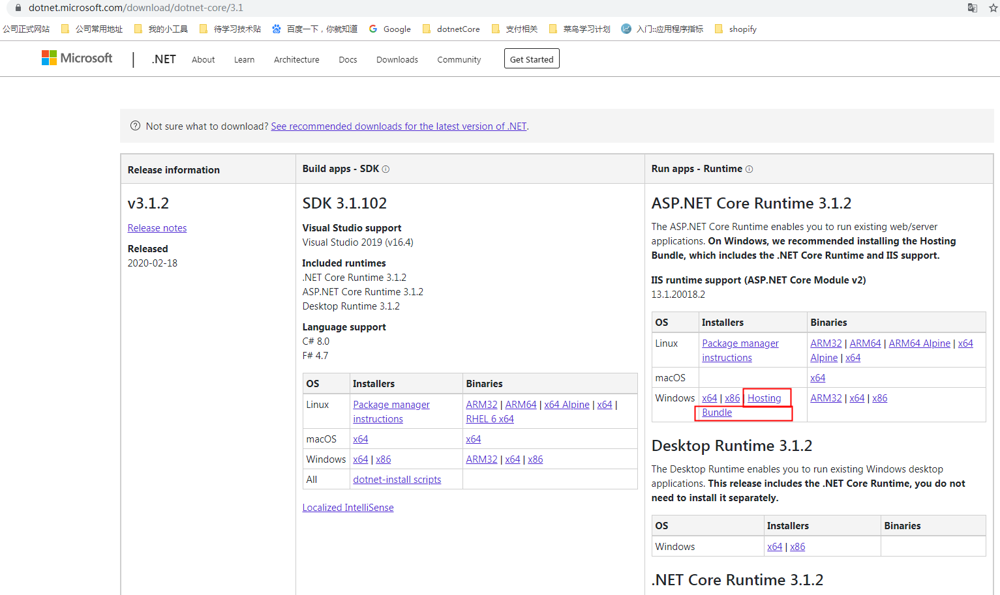

# IIS 部署 .Net Core

## 发布 .Net Core 项目到本地文件夹

注意 .Net Core 的部署模式有 `框架依赖`（部署平台需要有 .Net Core 运行时） 和 `独立`（任何 Pure 平台）两种模式。

## 本地安装 IIS

> 参考链接：[.net core入门-发布及部署_异常(处理程序“aspNetCore”在其模块列表中有一个错误模块“AspNetCoreModuleV2")处理](https://www.cnblogs.com/lxhbky/p/10677687.html)，[在IIS上部署你的ASP.NET Core项目](https://www.cnblogs.com/grom/articles/9337707.html)

1. 要部署 .Net Core 的项目，IIS 需要安装 `AspNetCoreModuleV2` 模块（不知道是不是受到选择 `框架依赖` 的影响，可以试下选择 `独立` 后且没有 `AspNetCoreModuleV2` 的情况下网站能不能正常运行），IIS 的应用程序池的 .Net CLR 版本需要选择为 `托管`。

2. 模块官方下载地址：<https://dotnet.microsoft.com/download/dotnet-core/3.1>，选好对应的 .Net Core 版本后，选择IIS支持中的IIS runtime support（Hosting Bundle），如下图：

    

3. 网站启动后，就可以正常访问了

## 采用 Azure DevOps Pipeline 来发布 .Net Core 项目到本地的 IIS

1. 将本地电脑配置为 Pipeline 的 Agent（用来 Build、Deploy 等操作）

    - Build Agent，在 Azure DevOps 的 `Project Settings` 中选择 `Agent Pools`，新建一个 pool，之后在 Agents 中添加一个 agent，会弹出一个页面指导如何将本地电脑注册为一个 agent，具体操作见 [官方文档](https://docs.microsoft.com/en-us/azure/devops/pipelines/agents/v2-windows?view=azure-devops)，需要注意的是，在选择身份验证（pat, negotiate, alt, integrated）的时候，如果 Azure DevOps Server 部署在一个非 HTTPS 的环境时，pat（Personal access token）似乎不管用，要选择 `negotiate`（用户名和密码）的方式。

    - Deployment Groups，用于 Deploy 应用，在 `Pipelines` -> `Deployment groups` 中可看到配置，添加的操作基本和 Build Agent 一样，不同的是在配置的时候要加上 deploymentgroup 参数：`.\config.cmd --deploymentgroup --deploymentgroupname "DESKTOP-NIUAI"`

2. 新建一个针对 .Net Core 的 CI

3. 新建一个发布到 IIS 的 CD（IIS Web App Manager、IIS Web App Deploy），Deployment group 选择之前步骤创建的。在 `IIS Web App Manager` 任务中，可以配置将要部署网站的端口、应用程序池、文件物理路径等

4. 一切配置完成后，就可以触发 build、deployment 来发布你的应用程序了
