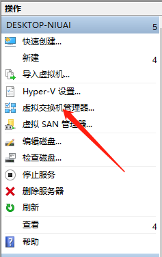
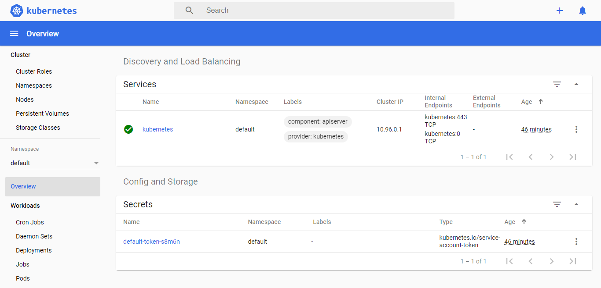
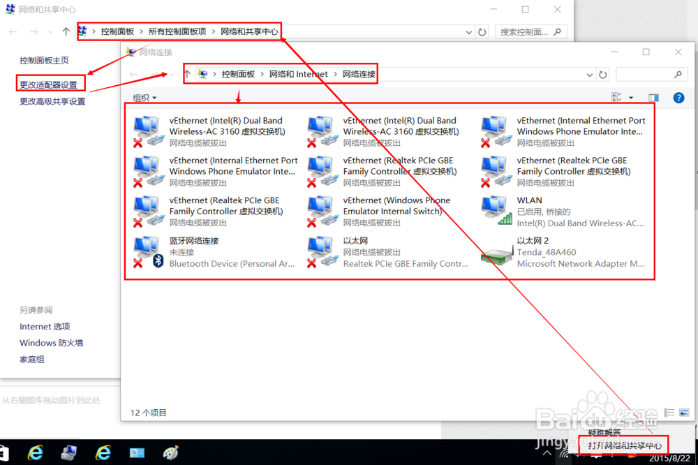

# Minikube

## Minikube 安装（Windows 10 Pro + Hyper-V）

> 自己已安装好 Docker

1. 下载 Minikube：<https://github.com/kubernetes/minikube/releases>

2. 下载 kubectl（kubernetes 的客户端）：[Install and Set Up kubectl](https://kubernetes.io/docs/tasks/tools/install-kubectl/)

3. 将以上两个工具的路径加到环境变量 Path 中

4. 打开 Hyper-V 管理器创建一个外部虚拟交换机

    > 注意：外部网络这里可能要多试几个，并非所有都是可行的，最好选名字带有 Wireless 的

      
      
    

5. 以 **管理员身份** 打开命令行，并键入以下命令来创建基于 Hyper-V 的 Kubernetes 测试环境（如果之前 #4 中的“外部网络”没有选好，敲入命令后可能会一直卡在创建虚拟机的步骤，这时就换个“外部网络”试试）

    ```powershell
    minikube start --image-mirror-country cn `
        --iso-url=https://kubernetes.oss-cn-hangzhou.aliyuncs.com/minikube/iso/minikube-v1.10.0.iso `
        --registry-mirror=https://registry.docker-cn.com `
        --vm-driver="hyperv" `
        --hyperv-virtual-switch="MinikubeSwitch" `
        --memory=2048
    ```

6. 然后就可以用以下命令来查看安装状态（minikube 命令需要管理员权限）：
    - `minikube status`：安装状态
    - `minikube dashboard`：打开 kubernetes 状态面板（浏览器）
    - `kubectl cluster-info`：查看 kubernetes 主节点状态

    

7. 在不用的时候可以通过运行以下命令来停止、开启 MiniKube

    ```shell
    minikube stop
    minikube start
    minikube delete # 删除 minikube
    ```

> 参考文章：  
> <https://www.cnblogs.com/shanyou/p/8503839.html>  
> <https://yq.aliyun.com/articles/221687>

## 使用中可能遇到的问题

1. 删除多余的网络连接

    在使用 Minikube 时，Hyper-V 每次的开启、关闭之后，会在 `控制面板 -> 网络和 Internet -> 网络连接` 下面创建很多新的“网络连接”，在该界面下无法直接删除（被禁用），那么该如何卸载他们呢？

    - 通过在“设备管理器”中卸载他们。[相关文档](https://jingyan.baidu.com/article/148a1921a2f6c94d71c3b132.html)

    
