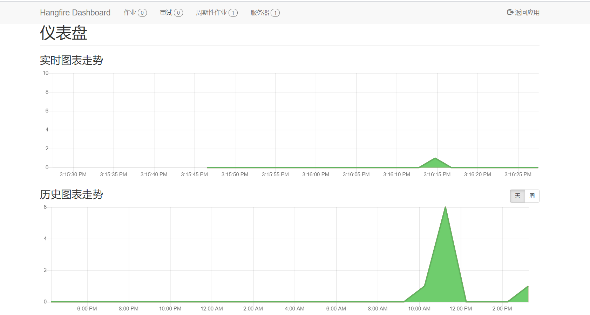

# Hangfire 使用

官网：<https://www.hangfire.io/>

GitHub：<https://github.com/HangfireIO/Hangfire>

## 项目引入（.Net Core 3.1）

```Shell
PM> Install-Package Hangfire
```

也可以单独安装 `Hangfire.AspNetCore`，默认安装了 `HangFire.SqlServer` 来作为消息存储，也可以安装 `Hangfire.Redis.StackExchange` 来使用 Redis 作为存储。

在 `Startup.cs` 中添加以下代码使 Hangfire 生效

```csharp
public void ConfigureServices(IServiceCollection services)
{
    services.AddHangfire(configuration =>
    {
        configuration.UseRedisStorage("127.0.0.1");
    });
}

public void Configure(IApplicationBuilder app, IWebHostEnvironment env)
{
    app.UseHangfireDashboard();
    app.UseHangfireServer(); // 表示将运行这行代码的实例作为一个Server，来消费信息。即如果没有这一行该实例只能发任务消息，不能处理任务
}
```

## 使用

默认情况下，打开运行实例的 `/hangfire`（开启了 Dashboard），会看到基本的页面，可以在该页面上查看运行情况、任务列表、历史任务运行结果等。



然后就可以在代码中发出任务消息->执行任务了

```csharp
BackgroundJob.Enqueue(() => Console.WriteLine("Simple!")); // 立即执行

BackgroundJob.Schedule(() => Console.WriteLine("Reliable!"), TimeSpan.FromDays(7)); // 延时执行

RecurringJob.AddOrUpdate(() => Console.WriteLine("Transparent!"), Cron.Daily); // 重复执行
```
