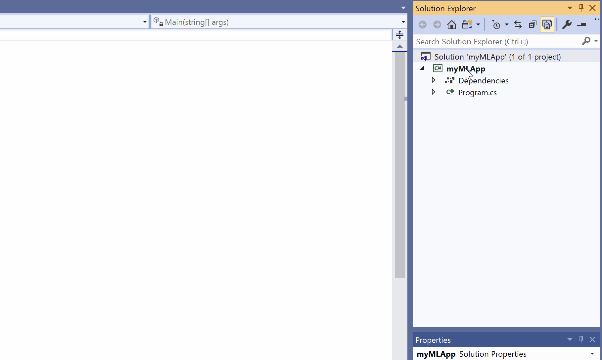
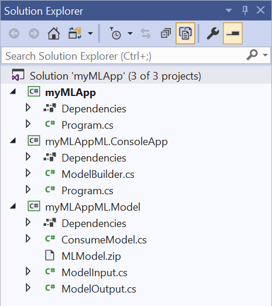

# ML.NET 简单使用

ML.NET是一个针对.NET开发人员使用的机器学习框架，使用它可以快速的搭建出一个sample。

## 下载安装VS应用扩展（ML.NET Model Builder）

> 目前 ML.NET Model Builder 处于预览状态

下载链接：<http://aka.ms/mlnettemplates>

## 创建一个 .NET Core 的控制台应用程序

> 官网强调项目和solution不能放在一个目录下，也还没试过放在一起会怎样。。

创建完项目后，右键项目点击 `Add` -> `Machine Learning`，之后VS的主界面会出现step-by-step的引导步骤，帮助你创建sample。



## 选择机器学习的模型

首先会让你选择训练的模型，目前该扩展提供了一些常见的模型（具体的应用场景），比如：语义分析（积极、消极）、GitHub Issue分类、价格预测等等。这里选择语义分析（Sentiment Analysis）

## 下载训练集数据

下载 [wikipedia-detox-250-line-data.tsv](https://raw.githubusercontent.com/dotnet/machinelearning/master/test/data/wikipedia-detox-250-line-data.tsv)，该文件的第一列表示 `Label`（预测结果），第二列表示 `Feature`（用来预测的根据）

在Model Builder里选择添加数据（目前支持本地文件和SQL Server），选择刚刚下载的 `wikipedia-detox-250-line-data.tsv` 文件。**Column to predict (Label)** 选择第一列 `Sentiment`，**Input Column (Feature)** 选择剩余的其他列（第二列）。点击 `Train` 进入下一步。

## 训练你的模型

Model Builder会根据已有的算法来对选择的模型进行评估，最终给出各个算法的比较以及最佳算法。

填入给Model Builder训练数据的时间（10 sec，如果是大一些的数据集，你应该设置一个更大的时间），点击开始训练。以下是训练过程中的指标

- Status，训练状态，剩余时间，是否完成
- Best accuracy，最好的拟合度
- 最优算法，原文是 “performed the best”（表现得最好），不知道是不是拟合度最高，或是其他的综合指标

点击 `Evaluate` 进入下一步

## 评估你的模型

这会列出Model Builder用了哪些算法来评估你的模型，包括总结和各个算法列表（最多5个）。你可在 **Try your model** 测试你的模型，输入文字，点击 **Predict** 来预测句子的情感。

点击 `Code` 进入下一步（让你能在程序中通过以调用方法的形式来用该训练模型预测语义）

## 生成相关代码



- {myMLAppML}.ConsoleApp，控制台应用，`ModelBuilder.cs`：生成、训练，`Program.cs`：测试、运行模型
- {myMLAppML}.Model，.NET Standard类库，`ModelInput.cs`, `ModelOutput.cs` 输入、输出，`ConsumeModel.cs` 被调用方法，`MLModel.zip`(trained serialized ML model，暂不知怎么去理解这个文件)

## 在程序中调用模型

在一开始的控制台应用（不是Model Builder生成的那个）的 `Program.cs`，替换成以下内容：

```csharp
using System;
using MyMLAppML.Model;

namespace myMLApp
{
    class Program
    {
        static void Main(string[] args)
        {
            // Add input data
            var input = new ModelInput();
            input.SentimentText = "That is rude.";

            // Load model and predict output of sample data
            ModelOutput result = ConsumeModel.Predict(input);
            Console.WriteLine($"Text: {input.SentimentText}\nIs Toxic: {result.Prediction}");
        }
    }
}
```

运行，你就可以看到输出结果了。

## 其他

你现在可以尝试其他的模型，比如价格预测，对应的训练数据集：[Taxi Fare dataset](https://raw.githubusercontent.com/dotnet/machinelearning-samples/master/samples/csharp/getting-started/Regression_TaxiFarePrediction/TaxiFarePrediction/Data/taxi-fare-train.csv)

原文：[ML.NET Tutorial - Get started in 10 minutes](https://dotnet.microsoft.com/learn/ml-dotnet/get-started-tutorial/intro)
