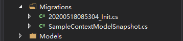
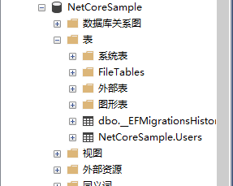

# EFCore 的简单使用

## 安装 nuget 包（MSSQL DB first）

```shell
Install-Package Microsoft.EntityFrameworkCore
Install-Package Microsoft.EntityFrameworkCore.SqlServer
Install-Package Microsoft.EntityFrameworkCore.Tools
```

## 创建实体、DBContext

```csharp
public class SampleContext : DbContext
{
    public SampleContext() : base() { }

    public SampleContext(DbContextOptions<SampleContext> options) : base(options)
    {

    }

    protected override void OnConfiguring(DbContextOptionsBuilder optionsBuilder)
    {
        base.OnConfiguring(optionsBuilder);
    }

    public DbSet<User> Users { get; set; }

    protected override void OnModelCreating(ModelBuilder modelBuilder)
    {
        modelBuilder.HasDefaultSchema("NetCoreSample"); // 不用默认的 [dbo] Schema，而是自定义该值

        base.OnModelCreating(modelBuilder);
    }
}
```

## 连接字符串

Windows验证，位于 `appsettings.json` 配置文件的根节点的 `ConnectionStrings` 节点下

```json
{
  "ConnectionStrings": {
    "Default": "Server=localhost\\SQLEXPRESS;Database=NetCoreSample;Trusted_Connection=True;"
  }
}
```

## 在 Startup.cs 类中的 `ConfigureServices` 方法里注入该 DBContext

```csharp
services.AddDbContext<SampleContext>(options => options.UseSqlServer(Configuration.GetConnectionString("Default")));
```

## 添加数据库迁移文件

打开程序包管理控制台，选择正确的默认项目，敲入 `add-migration [description]`，此时会自动生成迁移代码，再敲入 `update-database`，就可以将代码中的数据库结构反映到数据库（MSSQL、MySQL）中

- 自动生成的代码

    

- 数据库

    

## 使用

在代码中注入 `SampleContext`，就可以对该数据库增删改查了
