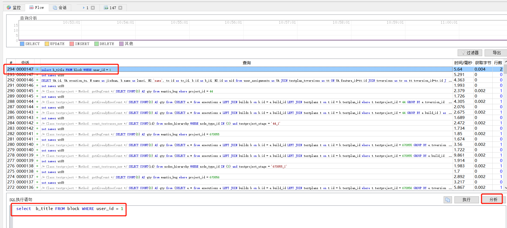

# MySQL 调用跟踪（Neor Profile SQL）

类似 SQL Server 的 SQL Profile 一样，Neor Profile SQL 提供了在 EF Core 调用 MySQL 时的语句查看

## 下载安装

免费下载地址：<https://www.profilesql.com/>

## 使用

1. 打开软件，连接上 MySQL 数据库，开启 Session

2. 修改 EF Core 连接数据库的连接字符串，地址为：127.0.0.1:4040（Neor Profile SQL 相当于在应用和数据库之间做了一个拦截），用户名、密码和数据库不变。具体为：`server=127.0.0.1;port=4040;user=admin;database=hahaha;pwd=xxx;SslMode=None`

3. 运行应用，产生 MySQL 的调用。就可以在 Neor Profile SQL 的 Session 中查看具体执行的语句了。

    
