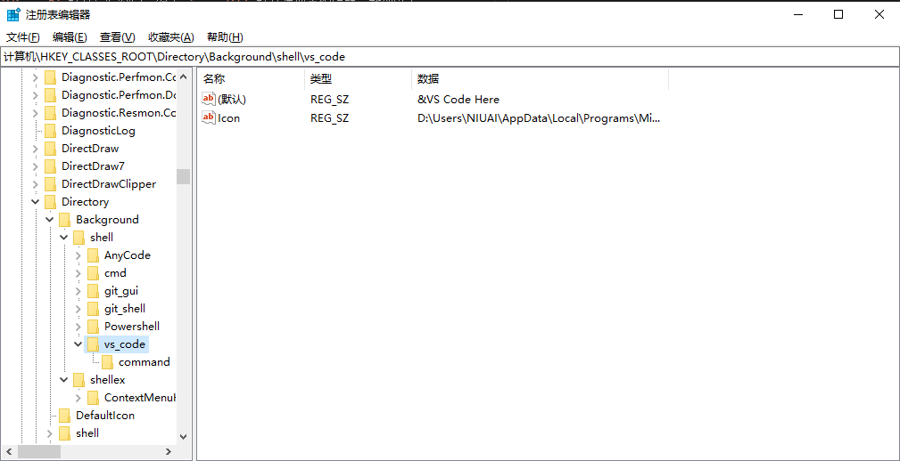

# 将应用添加到右键打开

> 环境为 Windows 10

1. `Win + R` 打开运行窗口，输入 `regedit` 打开注册表编辑器，找到以下目录（Background 表示点击文件夹里面的空白部分）：

    ```
    HKEY_CLASSES_ROOT\Directory\Background\shell
    ```

2. 右键 `shell` 添加项，可以起一个好记的名字，可以在右侧的 `Default` 里面设置右键菜单里显示的名称，也可以添加 `Icon` 字符串值设置图标。

    

3. 再右键该目录，添加新项 `command`（这个名字是固定的），`Default` 值设置为打开应用程序的方式。

> 参考：  
> [直接运行 .reg 脚本](https://thisdavej.com/right-click-on-windows-folder-and-open-with-visual-studio-code/)  
> [将 VS Code 添加到右键打开](https://www.howtogeek.com/howto/windows-vista/add-any-application-to-the-desktop-right-click-menu-in-vista/)
