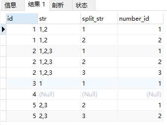

# MySQL 查询小技巧

## 行转列

将类似 `1,2,3` 的字段查询得到3列，分别为：1，2，3

```sql
drop table if exists temp_numbers;

create table temp_numbers (
    id int,
    str varchar(20)
);

insert into temp_numbers(id, str) values (1, '1,2');
insert into temp_numbers(id, str) values (2, '1,2,3');
insert into temp_numbers(id, str) values (3, '1');
insert into temp_numbers(id, str) values (4, null);
insert into temp_numbers(id, str) values (5, '2,3');

-- select * from temp_numbers;

select
    temp_numbers.id,
    temp_numbers.str,
    substring_index(substring_index(temp_numbers.str, ',', numbers.Id), ',', -1) as split_str,
    numbers.Id as number_id
from
    temp_numbers
left join (select @r1 := @r1 + 1 as Id from temp_numbers join (select @r1 := 0) a limit 50) numbers
    on char_length(temp_numbers.str) - char_length(replace(temp_numbers.str, ',', '')) >= numbers.Id - 1
order by
    temp_numbers.id, numbers.Id
;
```



## Join Update

```sql
UPDATE employees
    LEFT JOIN merits ON employees.performance = merits.performance
SET
    employees.salary = salary + salary * 0.015
WHERE
    merits.percentage IS NULL;
```

## 查看MySQL的版本

`select version() from dual`
