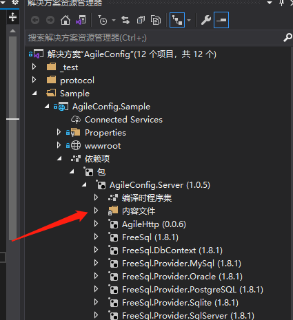

# .Net Core 类库打包上传到仓库

## 搭建私有仓库（BaGet）

> BaGet 是一个构建于 ASP.NET Core 基础上的 NuGet V3 服务器的开源实现

Github地址：<https://github.com/loic-sharma/BaGet>

参考文档：

- [十分钟搭建自己的私有NuGet服务器-BaGet](https://my.oschina.net/u/3772973/blog/4470291)
- [轻量级Nuget - BaGet k8s部署](https://www.cnblogs.com/shanyou/p/14692238.html)

本文采用 docker-compose 搭建，创建 `docker-compose.yaml` 文件

```yml
version: '3.7'
services:
    baget:
        image: loicsharma/baget
        container_name: baget
        ports:
            - 8088:80
        environment:
            ApiKey: 63edf24c-b70c-45c7-b3ed-f53c9f791e24
            Storage__Type: FileSystem
            Storage__Path: /var/baget/packages
            Database__Type: Sqlite
            Database__ConnectionString: Data Source=/var/baget/baget.db
            Search__Type: Database
            Mirror__Enabled: "true"
        volumes:
            - ./data:/var/baget
        restart: unless-stopped
```

等部署完成后，就可以在浏览器中输入 <http://localhost:8088> 来访问 BaGet 的页面了，与 nuget 的使用方式一致。提交包的方式

1. 打包生成 .nupkg 文件
2. 执行 `dotnet nuget push -s http://localhost:8088/v3/index.json AgileConfig.Server.1.0.5.nupkg --api-key 63edf24c-b70c-45c7-b3ed-f53c9f791e24` 来将包上传到私有的仓库中
3. 项目代码引用包

## 如何将Web项目修改成为类库

只需将 `.csproj` 文件中的 `<Project Sdk="Microsoft.NET.Sdk.Web">` 改为 `<Project Sdk="Microsoft.NET.Sdk">` 即可

## 将静态文件打包上传至私有仓库

有时项目文件中包含js、css等文件，并想提供给其他项目使用时，就可以将其一并打包到C#类库中

参考文档：

- <https://www.cnblogs.com/YrRoom/p/10893160.html>
- [使用 .NET Core 封裝 NuGet 套件並輸出靜態檔案](https://blog.poychang.net/output-static-content-file-to-project-in-dotnet-core-nuget-pack/)

1. 修改类库的 `.csproj` 文件，参考如下配置

    ```xml
    <Project Sdk="Microsoft.NET.Sdk">
    <PropertyGroup>
        <TargetFramework>netstandard2.0</TargetFramework>
        <PackageId>AgileConfig.Server</PackageId>
        <Version>1.0.5</Version>
        <Authors>NIUAI</Authors>
        <Company>NIUAI</Company>
        <CopyLocalLockFileAssemblies>CopyPackagesue</CopyLocalLockFileAssemblies>
    </PropertyGroup>
    
    <ItemGroup>
        <None Include="wwwroot\**">
        <Pack>true</Pack>
        <PackageCopyToOutput>true</PackageCopyToOutput>
        <!-- contentFiles\any\any\ 这里是固定写法，contentFiles\<language>\<target_framework> -->
        <PackagePath>contentFiles\any\any\wwwroot\</PackagePath>
        </None>
    </ItemGroup>
    ```

2. 包上传并被其他项目引用后（比如Web项目），本地调试时是无法在web根目录下生成之前打包的静态文件的，需要build项目，然后到bin目录下查找那些静态文件（然后可以copy到web项目的根目录下，从而可以本地运行调式项目）。静态文件可以在被引用的package的“内容文件”中看到（虚拟的，实际上本地目录不存在，build后在bin目录下能看到）

    

3. 至于怎样在web项目的根目录下还原静态文件，[这里](https://stackoverflow.com/questions/40469058/nuget-content-files-in-net-core-solution-not-getting-copied-when-installing-thr/56738870#56738870) 有讨论解决方法，由于能够通过bin目录copy过来，就没有深究了，有兴趣可以了解下

## 如何将多个类库打包成一个package，而不是每个类库单独打包

参考文档：

- [.NET Core NuGet 多项目套餐打包的正确姿势](https://www.cnblogs.com/dudu/p/11604992.html)

1. 修改主类库的 `.csproj` 文件，添加

    ```xml
    <PropertyGroup>
    <TargetsForTfmSpecificBuildOutput>$(TargetsForTfmSpecificBuildOutput);CopyProjectReferencesToPackage</TargetsForTfmSpecificBuildOutput>
    </PropertyGroup>
    <Target Name="CopyProjectReferencesToPackage" DependsOnTargets="ResolveReferences">
    <ItemGroup>
        <BuildOutputInPackage Include="@(ReferenceCopyLocalPaths->WithMetadataValue('ReferenceSourceTarget', 'ProjectReference'))" />
    </ItemGroup>
    </Target>
    ```

2. 此外，主类库引用的本地其他类库，需添加配置（只在主类库中这么修改）

    ```xml
    <ItemGroup>
        <ProjectReference Include="..\Agile.Config.Protocol\Agile.Config.Protocol.csproj">
            <PrivateAssets>all</PrivateAssets>
        </ProjectReference>
        <ProjectReference Include="..\AgileConfig.Server.Common\AgileConfig.Server.Common.csproj">
            <PrivateAssets>all</PrivateAssets>
        </ProjectReference>
    </ItemGroup>
    ```

3. 如果其他被引用的本地项目有第三方nuget依赖，需将那些依赖再都写到主类库的依赖中（否则主类库被引用时，不会去还原那些第三方的依赖）
