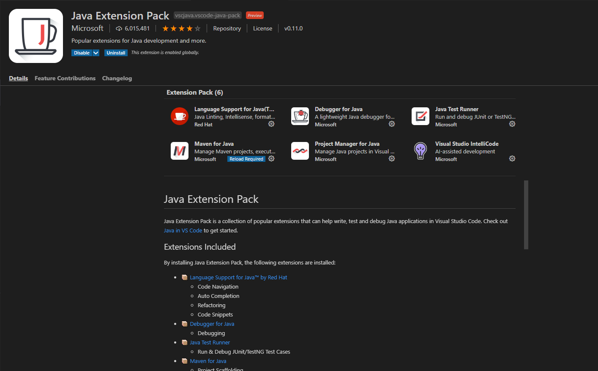

# 使用 VSCode 开发 Java 项目

1. 安装 [Java Extension Pack](https://marketplace.visualstudio.com/items?itemName=vscjava.vscode-java-pack) 插件，然后会自动安装所属的一系列 Java 开发包

    > 如果是离线安装，则需要将这些包分别下载下来安装

    

2. Maven 配置，在设置中搜索 `maven`，找到一系列相关的配置
    - maven.executable，可以设置执行路径
    - java.configuration.maven，可以设置 maven 的配置文件路径
