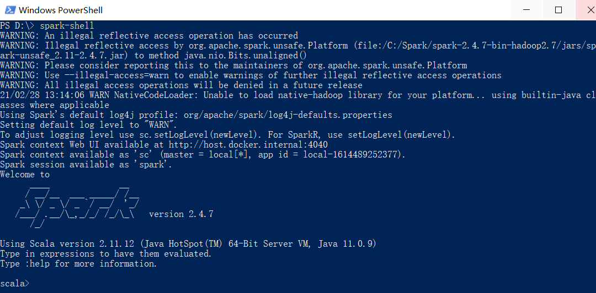

# Spark 使用入门

## 环境准备（Windows 10）

> 参考文档：[Windows上安装运行Spark](https://www.cnblogs.com/chevin/p/11064854.html)、[Spark学习笔记--Spark在Windows下的环境搭建](https://www.cnblogs.com/xuliangxing/p/7279662.html)

- Java SDK（8或者11以上）

- Scala：<https://www.scala-lang.org/download/>，此处版本 `2.11.12`（msi）

- Spark：此处版本为 `spark-2.4.7-bin-hadoop2.7`，配置环境变量

- Hadoop：此处版本为 `2.7.1`，解压到C盘，配置环境变量

一切准备就绪后，在命令行中输入 `spark-shell`，如果得到以下输出，表示环境已经搭建好了。此时就可以在shell中以交互方式调用Spark的API了

## VS Code 下开发 Spark（Scala）

> 参考文档：[VS Code下的Spark(Scala)开发](https://blog.csdn.net/lyd882/article/details/111638953)、[sbt 安装](https://www.cnblogs.com/jason-dong/p/10241640.html)

1. 安装SBT，此处为最新版本 `1.4.7`，自动配置环境变量。配置镜像仓库 `aliyum-maven: https://maven.aliyun.com/repository/central`。

2. 安装 VS Code 插件 `Scala (Metals)`

3. 创建 Spark 应用，点击左侧导航的插件（Scala），创建一个新的 Scala 项目（scala/hello-word.g8），创建完成后，进到项目目录，执行 `sbt` 命令进入 `sbt:hello-world>`，此时就可以编译（compile）、运行（run）项目了

除了 Scala 以外，Spark 还可以用 Java、Python、R 来开发
