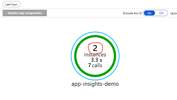
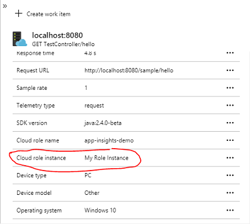

# Application Map 设置 Role 的 Instance 名称

> 本设置针对使用 SpringBoot 的应用程序。

如下图，对于同一个服务可能会有多个实例（默认的实例名为运行的机器名），以下步骤展示如何自定义该值：




- 添加 telemetry 初始化类

    > 参考链接：  
    > <https://github.com/microsoft/ApplicationInsights-Java/issues/632>  
    > <https://github.com/Microsoft/ApplicationInsights-Java/blob/master/azure-application-insights-spring-boot-starter/README.md>

    ```java
    package com.example.demo.configuration;

    import com.microsoft.applicationinsights.extensibility.TelemetryInitializer;
    import com.microsoft.applicationinsights.telemetry.Telemetry;
    import com.microsoft.applicationinsights.web.extensibility.initializers.WebTelemetryInitializerBase;

    public class CloudRoleNameInitializer implements  TelemetryInitializer  {

        @Override
        public void initialize(Telemetry telemetry) {
            String computerName = System.getenv().get("COMPUTERNAME");
            telemetry.getContext().getCloud().setRoleInstance(computerName);
        }
    }
    ```

- 在启动类（Application.java）中使用该类

    ```java
    package com.example.demo;

    import java.util.Arrays;

    import org.springframework.boot.CommandLineRunner;
    import org.springframework.boot.SpringApplication;
    import org.springframework.boot.autoconfigure.SpringBootApplication;
    import org.springframework.boot.builder.SpringApplicationBuilder;
    import org.springframework.boot.web.servlet.support.SpringBootServletInitializer;
    import org.springframework.context.ApplicationContext;
    import org.springframework.context.annotation.Bean;

    import com.microsoft.applicationinsights.extensibility.TelemetryInitializer;

    @SpringBootApplication
    public class Application extends SpringBootServletInitializer {

        @Override
        protected SpringApplicationBuilder configure(SpringApplicationBuilder application) {
            return application.sources(Application.class);
        }

        public static void main(String[] args) {
            SpringApplication.run(Application.class, args);
        }

        @Bean
        public TelemetryInitializer myTelemetryInitializer() {
            return new CloudRoleNameInitializer();
        }
    }
    ```

    然后就可以得到自定义的 `cloud role instance` 了，Application Map 里的 Instance 数量就等于 `cloud role instance` 的不同值的所有数量。

    
